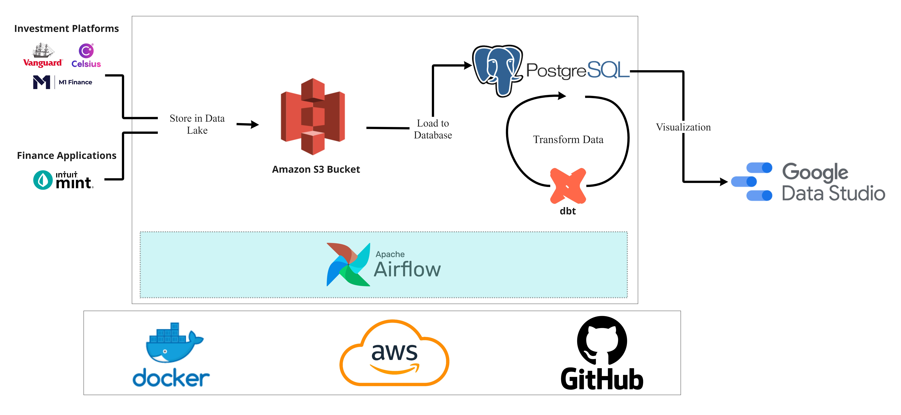
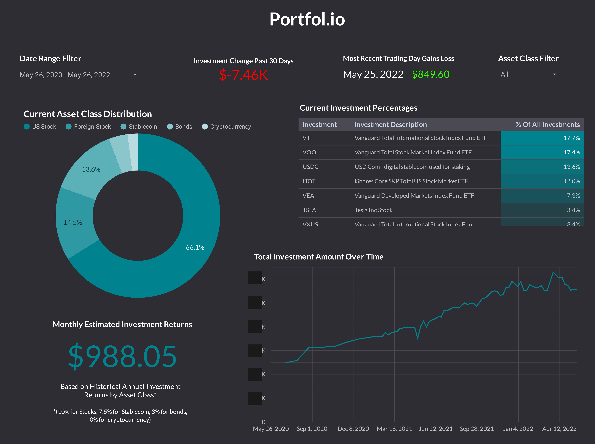

# Portfol.io

An investment tracking application with AWS, Docker, Airflow, dbt, PostgreSQL, web scraping, and much more!

## Description

### Objective

The Portfol.io application/project seeks to provide easy access for an investor to understand their investment performance aggregated across multiple financial platforms. It integrates with Vanguard, Coinbase, Intuit Mint, and more. Portfol.io uses a series of data pipelines to track and visualize investment returns, asset-class distributions, and total investments over time. The data is processed in real-time and stored to a data lake. This data is transformed using batch jobs to  create tables for visualization.

### Tools & Technologies

- Cloud - [**Amazon Web Services**](https://aws.amazon.com/)
- Containerization - [**Docker**](https://www.docker.com), [**Docker Compose**](https://docs.docker.com/compose/)
- Orchestration - [**Airflow**](https://airflow.apache.org)
- Transformation - [**dbt**](https://www.getdbt.com)
- Data Lake - [**Amazon S3**](https://aws.amazon.com/s3/)
- Data Warehouse - [**Amazon RDS**](https://aws.amazon.com/rds/), [**PostgreSQL**](https://www.postgresql.org/)
- Data Visualization - [**Data Studio**](https://datastudio.google.com/overview)
- Language - [**Python**](https://www.python.org)

### Architecture

### Final Result

## Methodology

### Application Overview

Financial and investment data is pulled via multiple APIs and beautiful soup screen-scraping scripts. The sources of the data are
- [**Vanguard**](http://vanguard.com/)
- [**Intuit Mint**](https://mint.intuit.com/)
- [**M1 Finance**](https://m1.com/)
- [**Celsius Network**](https://celsius.network/)
- [**Coinbase**](https://www.coinbase.com/)

The application is containerized in a Docker image and all data pipelines are orchestrated by Apache Airflow using directed acyclic graphs. Collected financial data gets converted into a CSV and stored into a data lake (AWS S3 bucket). From there, the data is uploaded into staging tables in a PostgreSQL database hosted by AWS. Subsequently, dbt SQL models are run to make calculated tables for visualization and analysis. This framework provides daily reports on trading days gains/losses, historical investment tracking, distributions across investment classes, and more.

This database connects to Google Data Studio to visualize in an automatically updating dashboard. 

### Setup

To configure the cloud tools for this project I made an account through AWS. This let me set up a S3 bucket and host my Postgres Database.

- AWS 
  - [**AWS Account and Access Setup**](https://aws.amazon.com/getting-started/)

Next, I set up configurations for the Docker image to host the application. Within this image I installed Apache Airflow and dbt.
  - [**Docker Set Up**](https://docs.docker.com/get-started/)
  - [**Apache Airflow Installation**](https://airflow.apache.org/docs/apache-airflow/stable/installation/index.html)
  - [**dbt Configuration**](https://docs.getdbt.com/dbt-cli/install/overview)

### Extracting Data

Financial data to track various account information is pulled from Intuit Mint using an unofficial API that scrapes account data called [**mintapi**](https://github.com/mintapi/mintapi).

Investment data is taken from Vanguard, M1 Finance, Celsius Network, and Coinbase to track multiple key statistics around investment returns and asset-class distributions. Celsius and Coinbase have readily available APIs to connect to their platforms when credentials and keys are provided. I used these to capture and track the user's cryptocurrency amounts. 
- [**Celsius Network API**](https://developers.celsius.network/portal)
- [**Coinbase API**](https://developers.coinbase.com/)

Both APIs were JSON APIs and GET functions were used to pull recent transaction history and investment amount across cryptocurrencies the user was invested in.

For M1 Finance and Vanguard I developed a screen-scraping tool using beautiful soup to track brokerage and retirement accounts investing in stocks, ETFs, mutual funds, and bonds. 

All of this data is then converted into a singular row with the datetime and put into a CSV format. From there, the data is stored into an S3 bucket. 

Both the extraction and loading process are done twice an hour to track financial changes quickly and accurately. Since a lot of this financial data is pulled through manual screen-scraping, I've encountered a variety of issues where the script doesn't work (if there's varied log-in flow or bot detection on the sites). After running some tests, pulling the data at this frequency allows the application to get an accurate picture of financial data multiple times a day even if a few attempts fail.

### Loading and Transforming

All data in the data lake is loaded directly into a PostgresSQL database storing current financial and stock information; dbt is then used as the data transformation tool to run calculations on daily trading gains, net worth value, monthly investment income calculations, and asset-class distribution. This process is run hourly using Airflow as the scheduling tool. 

### Visualization

I used [Google Data Studio](https://support.google.com/datastudio/answer/6283323?hl=en) as the visualization tool for this project.

### Application Security

Extra steps were taken to provide security in the application as people's personal data and financial information are used. These steps include
- After every load of financial data into the PostgreSQL database, the information is deleted from the data lake to ensure the data is being stored in only one place.
- Personal usernames, passwords, or anything beyond investment amounts aren't shown in the visualization. 
- Encryption is added onto the personal identifying information within the database and data lake to add more security.

## Lessons Learned and Next Steps

My intention with this project was to develop an end-to-end data intensive application, and I was able to accomplish this. I'm likely not going to develop this application much further because of work and personal obligations, but I may if I end up having more time in the future. Here's a list of things that I did vs what I can improve on as a lot can still be done :)

| What Application Currently Does  | Next Steps |
| ------------- | ------------- |
| Works for one user only  | Allow multiple users with their own personal dashboard   |
| Provides investment snapshots  | Provide investment advice to the user   |
| Shows asset-class distribution   | Display investment percentage across stock market sectors (finance, real estate, communication etc.) |
| Tracks Total Amount Invested Over Time   | Display historical gains and losses compared to amount invested  |
| Hosting Application Locally   | Hosting Application on a Cloud Environment  |

Building out the application further would involve two main components. Those are developing Portfol.io further so others users can join and also providing more information and advice to the user beyond what the visualizations currently show. The more opportunities to understand a user's investment, the greater the potential the application can have. Additionally, I'd love to build out the application to be running fully on AWS. 

## Challenges Faced

- Limited by Visualization Tool
  - Google Data Studio is not an easy visualizer to work with. I chose it because it was free, but the capacity for it is limited and I would have preferred to use Looker, Tableau, or Power BI. I had to rely on doing a lot of data transformations in dbt to track key statistics (like last trading day's investment returns and net worth increase over the past 30 days) because Google Data Studio couldn't do the calculations.
- Lack of APIs for Investment Platforms
  - In order to solve this problem I had to write beautiful soup screen-scraping scripts for Vanguard and M1 Finance. For Mint I used an unofficial API that relied on screen scraping as well. Multiple times a day the data doesn't get pulled at all because of varied log-in flow or bot detection from these websites. To combat this I just run my script very frequently to account for missed data pulls. 
- Difficult To Organize Data Architecture
  - I ingested account data by adding a new row with the account and investment details at the time of pulling. At the time, this was the best I could come up with, but even now I realize this methodology has flaws. I had to add more tables and write more complicated code than if I redid the table architecture to properly replicate star schema. 